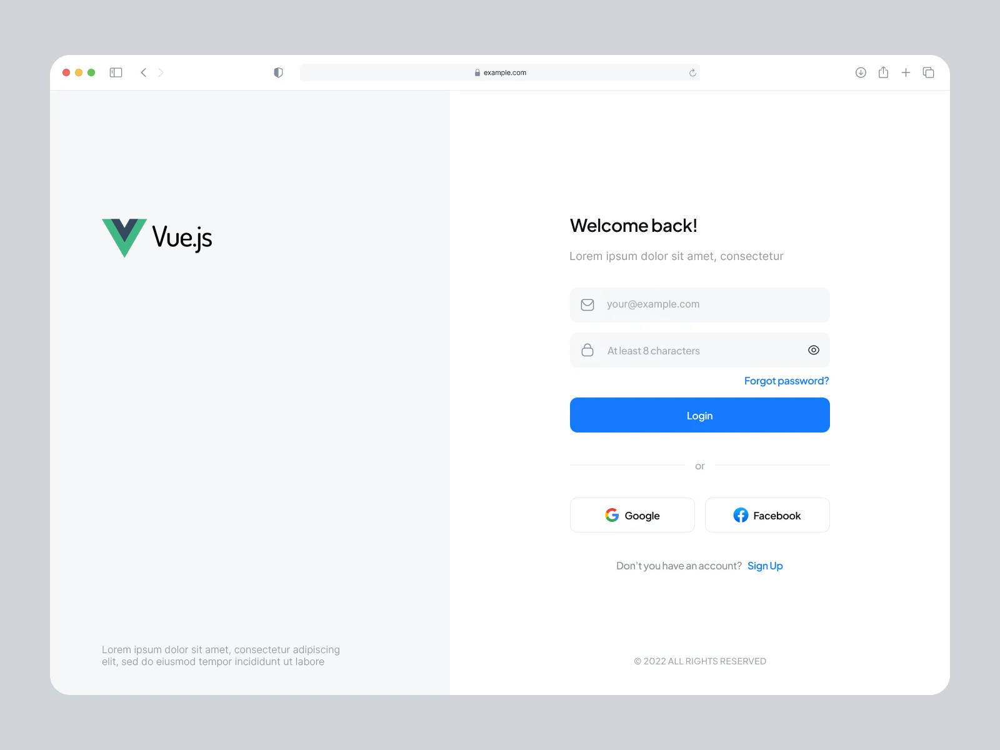

# Техническое задание: Форма Входа

## TLDR
  - форкаем репу себе в хаб
  - ставим зависимости (например) `pnpm i`
  - во время установки смотрим макет -> [ссылка](https://www.figma.com/design/TK943uETUC5YsWPSUGKukw/Auth-page-UI---test?node-id=0-1&t=IiCvImjwQdEslX8j-1)
  - запускаем проект (например) `pnpm dev`
  - кодим
  - в конце выслать ссылку на готовую репу с исходниками

## Стек
  - Vue 3
  - TypeScript
  - ESNext
  - CSS4 (scoped)

## Вспомогательные ресурсы
  - Рекомендованные шрифты: `Inter`, `Roboto`, `Open Sans`, `Lato` (уже подключены через `vite`)
  - `SVG` иконки уже добавлены в проект
    - для прямой вставки использовать: ``
    - для inline вставки: `<RawIcon name="password" color="black"></RawIcon>`
  - [Ссылка на макет](https://www.figma.com/design/TK943uETUC5YsWPSUGKukw/Auth-page-UI---test?node-id=0-1&t=IiCvImjwQdEslX8j-1)

## Описание
 - Задача состоит в создании приложения на `Vue 3`, используя `TypeScript`.
 - Стили должны быть написаны вручную, без использования UI-компонентов или библиотек вроде `Tailwind CSS`.
 - Компоненты создаются с использованием `<script setup lang="ts">`.
 - Акцентировать внимание на применение `defineProps()` и `defineEmits()` в сочитании `TypeScript`. Показать навык использования `composable` функций.

---

## Раздел 1. Визуальные требования

### 1. Композиция и сетка
Интерфейс разделен на две равные части:
- **Левая секция**: Логотип и текстовая надпись (произвольная).
- **Правая секция**: Форма авторизации, включающая элементы:
  - Логотип
  - Поля ввода email и пароля
  - Кнопки `Login` и `Forgot password`
  - Разделитель
  - Иконки соцсетей
  - Ссылка на регистрацию

Форма должна быть адаптивной: на мобильных устройствах левая секция скрывается, а форма занимает весь экран.

### 2. Форма авторизации
- Поля ввода и кнопки логически сгруппированы, элементы выровнены по макету.
- Кнопка `Login` — основной призыв к действию.
- Валидация:
  - Отображение ошибок при неверных данных (цветовая индикация, текст подсказки).
  - Успешная авторизация и ошибка выводятся через Toast с иконками (`SVG`).

### 3. Toast
- Всплывающее упрощенное модальное окно с уведомлением о текущем состоянии авторизации.
  - Удачная авторизация: `SVG` галочка и текст `Успех`.
  - Неудачная авторизация: `SVG` крестик и текст `Отказано`.

---

## Раздел 2. Технические требования

### 1. Реализация компонентов
- Использовать `<script setup lang="ts">` с `TypeScript`.
- Форма авторизации:
  - Данные формы отправляются в стор `Pinia`, где выполняется `action` для проверки `login` и `password`.
  - Результат проверки (успех/ошибка) возвращается в компонент формы и отображается через `Toast`.

### 2. Типизация
- Все пропсы и эмиты типизированы (`defineProps`, `defineEmits`).
- Запрещено использование `any` без объективных причин.

### 3. State Management (Pinia)
Использовать Pinia для:
- Хранения данных формы авторизации.
- Обработки экшена проверки данных (например, сравнение с user/user).

### 4. SVG и стили
- Все иконки (Toast, социальные сети) встраиваются инлайново в компоненты.
- Стили пишутся вручную (scoped) без использования UI-библиотек.

---

## Критерии оценки

### Минимальные обязательные требования:
1. Оформление страницы авторизации приближенно к макету (расположение элементов, адаптивность).
2. Добавление кнопки переключения состояния пароля (скрыть/показать) в соответствующем поле.
3. Добавление отклика у кнопки `Login` (по нажатию).
4. Использование `defineProps()` и `defineEmits()` при написании компонентов.
5. Демонстрация использования хранилища `Pinia` в любом виде.ℹ️
6. Вывод уведомления о текущем состоянии авторизации через форму (`Toast`).ℹ️

(ℹ️) -- выполнение данных требований будет плюсом.

Рекомендуется выполнить минимальную часть за 1 час, реализация остальных частей задания - будет плюсом.

---

## Дополнительные баллы:
1. Адаптивное поведение приложения на `mobile` и `tablet` устройствах.
2. Расширенная валидация (формат email, длина пароля).
3. Анимация переключения Toast.

---

## Предоставляемый результат
Конечный результат предпочительнее предоставить ссылкой на `github` с исходниками для анализа кода или же возможен `LiveCode` по желанию
